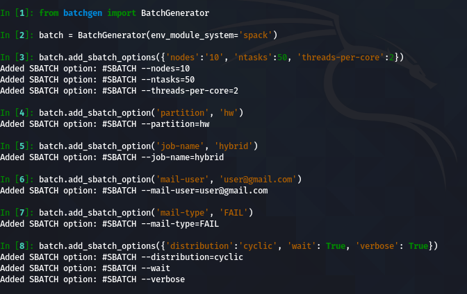
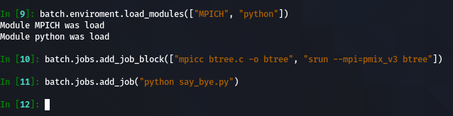
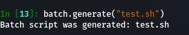
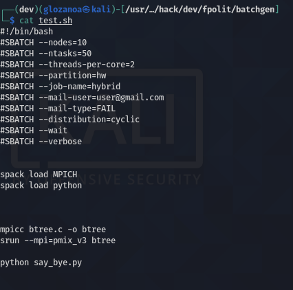

# Slurm's script generator

# Dependencies
* PySlurm
* tabulate

# Installation
```bash
$ python3 -m pip install batchgen
```

# Usage
I am going to generate a **batch** script that perform the following:
* Compile a hybrid algorithm (OMP + MPI) called `btree.c` using `MPICH` package which was installed using `spack`
* Run it with the following requirements:
    * Run with `10 nodes`, using `50 tasks` , `2 threads by core` and `1 GB of memory by node`
    * The job name will be `hybrid`
    * Notify to `user@gmail.com` email if my job FAILS
    * Type of distribution: `cyclic`
    * Perform the job until it ends in the partition `hw`
    * Run in verbose mode
* Finaly run a python script called `say_bye.py` using `python` package which was installed using `spack`


### Configuring SBATCH options




### Configuring enviroment and adding job



### Generating batch script




